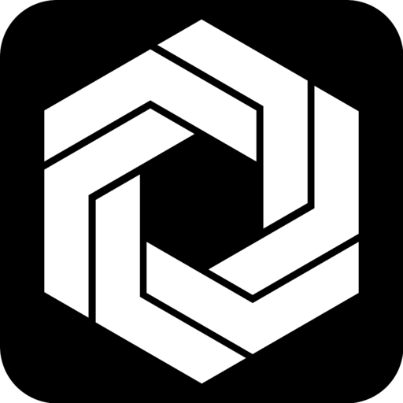

  

<h3 align="center">Kijk</h3>

---

 Meet <strong>Kijk</strong>: the open-source household app for effortless energy/resource monitoring. It's your all-in-one solution, simplifying expense tracking, income management, and energy consumption monitoring.
 

> This Project is still under development

## 📝 Table of Contents

- [Motivation](#motivation)
- [Getting Started](#getting_started)
- [Developer Guide](#developer-guide)
- [Deployment](#deployment)
- [Built Using](#built_using)
- [Contributing](../CONTRIBUTING.md)
- [Acknowledgments](#acknowledgement)

## 🧠Motivation 

At the core of Kijk is my motivation to explore new technologies while crafting an app that caters to every user, including myself. I embarked on this journey to create a household app that simplifies energy/resource monitoring, driven by my own need for such a tool.
I invite you, as new users, to join this project. Let's collaborate on this open-source project, combining our skills to make Kijk an even more valuable asset for household management. Your participation and contributions will not only enhance the app's features but also ensure that it addresses a wider array of needs and preferences. Together, we can shape a tool that empowers us all to manage our homes efficiently and effortlessly.

Feel free to explore the codebase to get inspiration or help with this project 🫶

## 🏁 Getting Started 

If you want to use the live production app go to this [link](https://kijk-client.vercel.app/) and feel free to leave some feedback on our [discussion board](https://github.com/maxstue/kijk/discussions).
And if you are a developer and want to contribute to this project please go [here](#developer-guide) for more information.

## 🖥️ Developer Guide 

Please refer to the contributing [guide](./docs/) for how to install Kijk from sources.

## 🚀 Deployment 

The deployed system runs on [vercel](https://vercel.com/) and [fly.io](https://fly.io/), for further information go to the deplyoment [documentation](./docs/developers/deployment.md).

## ⛏️ Built Using 

- [React](https://react.dev/) - Frontend Library
- [Vite](https://vitejs.dev/) - Bundler
- [Tailwind](https://tailwindcss.com/) - Styling
- [dotnet](https://dotnet.microsoft.com/en-us/) - Server Framework
- [PostgreSQL](https://www.postgresql.org/) - Database

## 🉠Acknowledgements 

- [shadcn/ui](https://github.com/shadcn-ui/ui)
- [The Documentation Compendium](https://github.com/kylelobo/The-Documentation-Compendium)
- openAi for helping with writing texts 🤖
